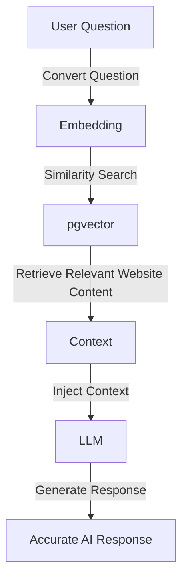

⭐ If you are reviewing this project for the Perpova internship, please watch the 2-minute demo video first.

# 🚀 Perpova White-Label AI Engine (Laravel 11 Backend)

Proof-of-Work Project built for the **Software Engineer Intern** application at **Perpova Developers**.

This repository contains the backend AI engine powering a **B2B White-Label AI Chat System** designed for development agencies.

The system allows agencies to **instantly add AI-powered search and chat** to any client website while ensuring responses are grounded in the client's real data, preventing hallucinations.

## 🔗 Related Links

- **Frontend Widget Repository**: [https://github.com/Niluminda-glitch/perpova-ai-widget](https://github.com/Niluminda-glitch/perpova-ai-widget)
- **2-Minute Demo Video**: [https://drive.google.com/file/d/1Af3cAupV3IDS9MiPpPsca6dHjE7emASo/view?usp=sharing](https://drive.google.com/file/d/1Af3cAupV3IDS9MiPpPsca6dHjE7emASo/view?usp=sharing)

## 💡 The Business Problem

Development agencies build websites for clients every day.

Many clients now want AI assistants on their websites, but there are major challenges:

1. Clients often lack technical knowledge to implement AI properly
2. Generic AI tools hallucinate incorrect information
3. Secure AI deployments require backend infrastructure

**This project demonstrates how agencies can offer AI-powered search as a scalable premium feature.**

### The System Works By

1. Accepting a **client's website URL**
2. **Crawling and extracting** meaningful content
3. Converting the content into **vector embeddings**
4. Storing embeddings in a **vector database**
5. Providing **accurate AI answers** based *only* on that data

## 🧠 Architecture Overview

This backend implements a **RAG (Retrieval-Augmented Generation)** pipeline.



## ⚙️ Technology Stack

| Component | Technology |
| :--- | :--- |
| **Framework** | Laravel 11 |
| **Language** | PHP 8+ |
| **Database** | PostgreSQL |
| **Vector Database** | pgvector |
| **Hosting** | Supabase |
| **Embeddings Model** | BAAI/bge-base-en-v1.5 |
| **LLM Engine** | Groq Cloud |
| **Model** | Llama-3.3-70B |

## 🔍 Core APIs

### Website Ingestion API

- **Endpoint**: `POST /api/ingest`
- **Function**:
    - Accepts a website URL
    - Crawls and scrapes page content
    - Cleans HTML and extracts readable text
    - Splits text into smaller chunks
    - Generates embeddings using Hugging Face
    - Stores vectors inside PostgreSQL

### AI Chat API

- **Endpoint**: `POST /api/chat`
- **Function**:
    - Receives user questions from the React widget
    - Converts the question into an embedding
    - Performs cosine similarity search using pgvector
    - Retrieves the most relevant website content
    - Injects context into the Llama-3 prompt
    - Generates a grounded AI response

## 🛠 Local Development Setup

### 1️⃣ Clone Repository

```bash
git clone https://github.com/Niluminda-glitch/perpova-ai-backend.git
cd perpova-ai-backend
```

### 2️⃣ Install Dependencies

```bash
composer install
```

### 3️⃣ Configure Environment Variables

Create a `.env` file:

```env
DB_CONNECTION=pgsql
DB_HOST=your_supabase_host
DB_PORT=5432
DB_DATABASE=postgres
DB_USERNAME=your_supabase_username
DB_PASSWORD=your_supabase_password

GROQ_API_KEY=your_groq_api_key
HF_TOKEN=your_huggingface_token
```

### 4️⃣ Run Laravel Server

```bash
php artisan serve
```

Server will run at: `http://localhost:8000`

## 📈 Possible Future Improvements

- [ ] Multi-website ingestion support
- [ ] Authentication and API rate limiting
- [ ] WordPress plugin wrapper
- [ ] Scheduled website re-indexing
- [ ] Agency dashboard for managing clients

## 👨‍💻 Author

**Kavishka Niluminda**

- **Software Engineering Student** – NIBM
- **Merit Scholar** (Rank 1 Island-wide)

- **Portfolio**: [https://www.kavishkaniluminda.me](https://www.kavishkaniluminda.me)
- **LinkedIn**: [https://www.linkedin.com/in/kavishka-niluminda-2b9a23268](https://www.linkedin.com/in/kavishka-niluminda-2b9a23268)
